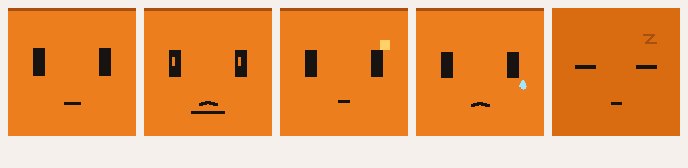

# CodexFace for MagiClick ESP32-S3

Turn a MagiClick ESP32-S3 desktop toy into a Codex status face with:

- 5 animated states: `idle`, `working`, `attention`, `blocked`, `off`
- BLE control in the browser through Nordic UART
- USB serial control for setup and debugging
- a browser console with live preview, text overlay, and color palette presets
- Codex hooks that automatically switch the face based on session activity



## What is in this repo

- `codex_status.py`
  CircuitPython app for the device screen and BLE command handling
- `web/index.html`
  browser management page
- `install_codex_face_to_board.py`
  installer that writes the app and required BLE libraries to the board
- `send_codex_face.py`
  simple command sender over USB serial
- `launch_codex_face_now.py`
  forces the board back into `/app/CodexFace.py` if it is stuck in REPL
- `codex_face_hook.py`
  lightweight serial sender used by Codex hooks
- `install_codex_hooks.py`
  installs a reusable `~/.codex/hooks.json` from the template in this repo
- `codex_hooks_template.json`
  portable Codex hook template
- `vendor/circuitpython9/lib/adafruit_ble`
  vendored CircuitPython BLE dependencies used by the installer

## Hardware and software

- MagiClick S3 / ESP32-S3 board running CircuitPython 9.x
- Python 3.9+
- Chrome or Edge for browser BLE / Web Serial features

Install local Python dependency:

```bash
python3 -m pip install -r requirements.txt
```

## Flash the board app

Connect the board over USB, then run:

```bash
python3 install_codex_face_to_board.py
```

This writes:

- `codex_status.py` to `/app/CodexFace.py`
- the required BLE `.mpy` files to `/lib/adafruit_ble/...`

If the CIRCUITPY drive mounts read-only, the installer falls back to the serial REPL path and remounts the device filesystem writable before uploading.

## Open the management page

Run:

```bash
./serve_web_console.sh
```

Then open:

- local use: `http://127.0.0.1:4173`

The page supports:

- BLE connect
- USB serial connect
- state switching
- one-line text overlay
- palette editing for `bg`, `feature`, `accent`, `title`, `warn`, and `sweat`

## Browser support and direct connect

This project uses `Web Bluetooth` and `Web Serial`.

That means:

- `localhost` works best during local development
- HTTPS works for direct browser BLE on other computers
- plain LAN HTTP such as `http://192.168.x.x:4173` may open the page but often cannot use Web Bluetooth or Web Serial because those APIs require a secure context

Useful references:

- [MDN Web Bluetooth API](https://developer.mozilla.org/en-US/docs/Web/API/Web_Bluetooth_API)
- [MDN Web Serial API](https://developer.mozilla.org/en-US/docs/Web/API/Web_Serial_API)
- [Chrome Web Bluetooth docs](https://developer.chrome.com/docs/capabilities/bluetooth)

If you want another computer to directly connect to the nearby device, publish the `web/` app over HTTPS, for example with GitHub Pages, Netlify, or Vercel.

This repo already includes a GitHub Pages workflow:

- `.github/workflows/deploy-pages.yml`

Once the repository is public on GitHub and Pages is enabled, the web console can be served from a GitHub Pages `https://...` URL.

## Device command protocol

State commands:

- `idle`
- `working`
- `attention`
- `blocked`
- `off`

Text commands:

- `text hello`
- `cleartext`

Palette commands:

- `palette`
- `palette reset`
- `palette bg=#EC7E1D feature=#161311 accent=#A95010 title=#F7C28E warn=#FFD166 sweat=#A3E6FF`
- `color feature #161311`

Utility commands:

- `status`
- `ping`

BLE uses Nordic UART Service:

- Service UUID: `6E400001-B5A3-F393-E0A9-E50E24DCCA9E`
- RX UUID: `6E400002-B5A3-F393-E0A9-E50E24DCCA9E`
- TX UUID: `6E400003-B5A3-F393-E0A9-E50E24DCCA9E`

## Manual control

Examples:

```bash
python3 send_codex_face.py idle
python3 send_codex_face.py working
python3 send_codex_face.py --text "Thinking"
python3 send_codex_face.py --clear
python3 launch_codex_face_now.py
```

If your board is not on the default serial port, set one of:

```bash
export CODEX_FACE_PORT=/dev/cu.usbmodemXXXX
export MAGICLICK_PORT=/dev/cu.usbmodemXXXX
```

## Codex integration

Install the hook config:

```bash
python3 install_codex_hooks.py
```

This will:

- copy `codex_face_hook.py` into `~/.codex/hooks/agent_face_hook.py`
- generate `~/.codex/hooks.json` from `codex_hooks_template.json`

The default mapping is:

- `SessionStart` -> `idle`
- `UserPromptSubmit` -> `working`
- `PreToolUse` -> `working`
- `PostToolUse` -> `working`
- `PermissionRequest` -> `blocked`
- `PreCompact` -> `attention`
- `Stop` -> `idle`

## Optional: full flash backup

If you want a raw flash backup before experimenting:

```bash
python3 -m venv .venv-esptool
./.venv-esptool/bin/pip install esptool
./backup_esp32s3.sh
```

Backups are intentionally ignored by git and not included in the public repo.

## Suggested open-source publishing flow

1. Put this repo on GitHub as a public repository.
2. Enable GitHub Pages or let the included Pages workflow deploy `web/`.
3. Open the resulting `https://...` page from another computer with Chrome or Edge.
4. Click `连接蓝牙` and connect to the nearby `CodexFace` device.

## License

MIT
